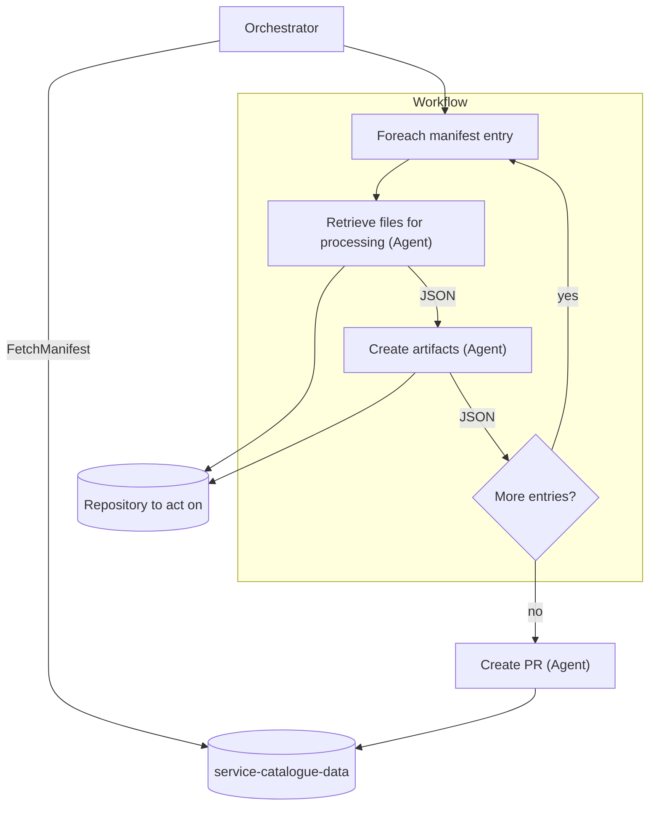
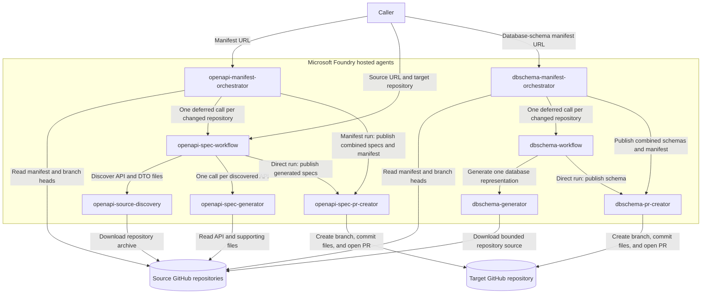

# Source Control Agent Pipelines

This repository contains Azure AI Foundry hosted agents for manifest-driven source analysis. The OpenAPI, database-schema, event/command-catalog, external-service-dependency, C4, local-development-configuration, and .NET-version pipelines generate repository artefacts and create one combined pull request for all successful manifest entries.

## Pattern

Every pipeline in this repository follows the same shape: an orchestrator fetches the manifest from `service-catalogue-data`, then for each manifest entry a discovery agent retrieves the relevant files from the repository being analyzed and a generator agent turns them into structured artifacts, looping until every entry has been processed. Once the loop completes, one PR-creator agent commits every generated artifact back into `service-catalogue-data` in a single pull request.



## Pipeline

1. [`openapi-source-discovery`](agents/hosted/openapi/openapi-source-discovery/README.md) scans one GitHub repository path and returns a root JSON array of `{apiFile, supportingFiles}` objects.
2. [`openapi-spec-generator`](agents/hosted/openapi/openapi-spec-generator/README.md) accepts one discovery element and returns an OpenAPI 3.1 JSON object.
3. [`openapi-spec-pr-creator`](agents/hosted/openapi/openapi-spec-pr-creator/README.md) accepts all generated specs, writes them to a destination repository, and opens a pull request.
4. [`openapi-spec-workflow`](agents/hosted/openapi/openapi-spec-workflow/README.md) runs the complete sequence, invoking the generator once per discovered API and sending the combined result to the PR creator.
5. [`openapi-manifest-orchestrator`](agents/hosted/openapi/openapi-manifest-orchestrator/README.md) checks manifest commit hashes and creates one combined specs-and-manifest pull request for changed repositories.

### Agent interactions and dependencies



The dependency order is:

- `openapi-source-discovery`, `openapi-spec-generator`, and `openapi-spec-pr-creator` are leaf agents and can be deployed independently.
- `openapi-spec-workflow` depends on all three leaf agents.
- `openapi-manifest-orchestrator` depends on `openapi-spec-workflow` and `openapi-spec-pr-creator`.
- `dbschema-generator` and `dbschema-pr-creator` are database-schema leaf agents.
- `dbschema-workflow` depends on both leaf agents.
- `dbschema-manifest-orchestrator` depends on `dbschema-workflow` and `dbschema-pr-creator`.
- `eventcatalog-source-discovery`, `eventcatalog-generator`, and `eventcatalog-pr-creator` are leaf agents.
- `eventcatalog-workflow` depends on those three leaf agents.
- `eventcatalog-manifest-orchestrator` depends on `eventcatalog-workflow` and `eventcatalog-pr-creator`.
- `service-dependency-source-discovery`, `service-dependency-generator`, and `service-dependency-pr-creator` are leaf agents.
- `service-dependency-workflow` depends on those three leaf agents.
- `service-dependency-manifest-orchestrator` depends on `service-dependency-workflow` and `service-dependency-pr-creator`.
- `c4-source-discovery`, `c4-generator`, and `c4-pr-creator` are leaf agents.
- `c4-workflow` depends on those three leaf agents.
- `c4-manifest-orchestrator` depends on `c4-workflow` and `c4-pr-creator`.
- `local-dev-config-source-discovery`, `local-dev-config-generator`, and `local-dev-config-pr-creator` are leaf agents.
- `local-dev-config-workflow` depends on those three leaf agents.
- `local-dev-config-manifest-orchestrator` depends on `local-dev-config-workflow` and `local-dev-config-pr-creator`.
- `dotnet-version-source-discovery` and `dotnet-version-pr-creator` are leaf agents; `dotnet-version-generator` is also a leaf agent but is fully deterministic (no model call).
- `dotnet-version-workflow` depends on those three leaf agents.
- `dotnet-version-manifest-orchestrator` depends on `dotnet-version-workflow` and `dotnet-version-pr-creator`.

Previous workflows, scripts, prompt agents, and documentation are retained under [`backup/`](backup/).

## Database schema orchestration

[`dbschema-generator`](agents/hosted/dbschema/dbschema-generator/README.md) scans a repository path for database entities and returns tables, columns, relationships, indexes, and named types. [`dbschema-workflow`](agents/hosted/dbschema/dbschema-workflow/README.md) generates and optionally publishes one repository schema. [`dbschema-manifest-orchestrator`](agents/hosted/dbschema/dbschema-manifest-orchestrator/README.md) invokes one deferred workflow per changed repository and sends all successful schemas plus the updated manifest to [`dbschema-pr-creator`](agents/hosted/dbschema/dbschema-pr-creator/README.md) in one request.

## Event and command catalog orchestration

[`eventcatalog-source-discovery`](agents/hosted/eventcatalog/eventcatalog-source-discovery/README.md) deterministically selects message and handler files. [`eventcatalog-generator`](agents/hosted/eventcatalog/eventcatalog-generator/README.md) extracts validated commands, events, fields, and handlers. [`eventcatalog-workflow`](agents/hosted/eventcatalog/eventcatalog-workflow/README.md) writes one `<repository>/event-catalog/events-and-commands.json` file through [`eventcatalog-pr-creator`](agents/hosted/eventcatalog/eventcatalog-pr-creator/README.md), while [`eventcatalog-manifest-orchestrator`](agents/hosted/eventcatalog/eventcatalog-manifest-orchestrator/README.md) combines changed repositories and the manifest update into one PR.

## Service dependency orchestration

[`service-dependency-source-discovery`](agents/hosted/servicedependencies/service-dependency-source-discovery/README.md) deterministically selects client, registration, configuration, messaging, database, cache, storage, and cloud-integration sources. [`service-dependency-generator`](agents/hosted/servicedependencies/service-dependency-generator/README.md) extracts a validated catalog without returning secret values. [`service-dependency-workflow`](agents/hosted/servicedependencies/service-dependency-workflow/README.md) writes one `<repository>/service-dependencies/service-dependencies.json` file through [`service-dependency-pr-creator`](agents/hosted/servicedependencies/service-dependency-pr-creator/README.md), while [`service-dependency-manifest-orchestrator`](agents/hosted/servicedependencies/service-dependency-manifest-orchestrator/README.md) processes only `service-dependencies` nodes and combines changed repositories with the manifest update in one PR.

```json
{
  "github-repo": "https://github.com/owner/application",
  "service-dependencies": {
    "path-to-scan": "tree/main/src",
    "last-commit-hash-scanned": ""
  }
}
```

## C4 orchestration

[`c4-source-discovery`](agents/hosted/c4/c4-source-discovery/README.md) deterministically selects source, configuration, dependency, and infrastructure files that can evidence C4 context and container diagrams. [`c4-generator`](agents/hosted/c4/c4-generator/README.md) extracts a validated C4 model and draw.io `mxfile` XML for `context.drawio` and `container.drawio`. [`c4-workflow`](agents/hosted/c4/c4-workflow/README.md) writes one `<repository>/c4/` directory through [`c4-pr-creator`](agents/hosted/c4/c4-pr-creator/README.md), while [`c4-manifest-orchestrator`](agents/hosted/c4/c4-manifest-orchestrator/README.md) processes only `c4` nodes and combines changed repositories with the manifest update in one PR.

```json
{
  "github-repo": "https://github.com/owner/application",
  "c4": {
    "path-to-scan": "tree/main/src",
    "last-commit-hash-scanned": ""
  }
}
```

## Local dev config orchestration

[`local-dev-config-source-discovery`](agents/hosted/localdevconfig/local-dev-config-source-discovery/README.md) deterministically selects docker-compose files, `.env` examples, and application configuration files that can evidence the local services a repository needs to run. [`local-dev-config-generator`](agents/hosted/localdevconfig/local-dev-config-generator/README.md) extracts a validated catalog of local services and configuration key names, without returning secret values. [`local-dev-config-workflow`](agents/hosted/localdevconfig/local-dev-config-workflow/README.md) writes one `<repository>/local-dev-config/local-dev-config.json` file through [`local-dev-config-pr-creator`](agents/hosted/localdevconfig/local-dev-config-pr-creator/README.md), while [`local-dev-config-manifest-orchestrator`](agents/hosted/localdevconfig/local-dev-config-manifest-orchestrator/README.md) processes only `local-dev-config` nodes and combines changed repositories with the manifest update in one PR.

```json
{
  "github-repo": "https://github.com/owner/application",
  "local-dev-config": {
    "path-to-scan": "tree/main/src",
    "last-commit-hash-scanned": ""
  }
}
```

## .NET version orchestration

[`dotnet-version-source-discovery`](agents/hosted/dotnetversion/dotnet-version-source-discovery/README.md) deterministically selects `.csproj` and `global.json` files, ignoring `bin`, `obj`, `packages`, and `node_modules`. [`dotnet-version-generator`](agents/hosted/dotnetversion/dotnet-version-generator/README.md) deterministically parses each file's XML/JSON directly -- no model is used -- into target framework and SDK version entries. [`dotnet-version-workflow`](agents/hosted/dotnetversion/dotnet-version-workflow/README.md) writes one `<repository>/dotnet-version/dotnet-version.json` file through [`dotnet-version-pr-creator`](agents/hosted/dotnetversion/dotnet-version-pr-creator/README.md), while [`dotnet-version-manifest-orchestrator`](agents/hosted/dotnetversion/dotnet-version-manifest-orchestrator/README.md) processes only `dotnet-version` nodes and combines changed repositories with the manifest update in one PR.

```json
{
  "github-repo": "https://github.com/owner/application",
  "dotnet-version": {
    "path-to-scan": "tree/main/src",
    "last-commit-hash-scanned": ""
  }
}
```

## Run the complete workflow

Invoke `openapi-spec-workflow` with:

```json
{
  "sourceUrl": "https://github.com/owner/application/tree/main/src/Api",
  "targetRepository": "owner/api-specifications",
  "targetDirectory": "application/open-api",
  "targetBaseBranch": "main"
}
```

Only `sourceUrl` and `targetRepository` are required. The response is always JSON and contains discovery/generation counts, per-file generation errors, and the PR creator result including `pullRequestUrl`.

Generated file paths are deterministic and flat. By default, `src/Api/BidsController.cs` from the `application` repository becomes `application/open-api/BidsController.openapi.json`.

## Run every flow against one repository

[`.github/workflows/run-all-flows.yml`](.github/workflows/run-all-flows.yml) is a manual (`workflow_dispatch`) action that looks up one repository's entry in a manifest and invokes every `*-workflow` agent that has a node on that entry — OpenAPI, database schema, event/command catalog, service dependency, C4, local dev config, and .NET version — in parallel. Each flow uses its own `path-to-scan` from the manifest entry (they are not all the same subdirectory), so, for example, `dbschema` might scan `src/Data` while `eventcatalog` scans `src/Application` for the same repository. The destination repository and base branch are derived from the manifest URL itself, matching the convention the `*-manifest-orchestrator` agents already use. Inputs:

| Input | Required | Notes |
| --- | --- | --- |
| `manifest_url` | Yes | Manifest blob URL, e.g. `https://github.com/owner/service-catalogue-data/blob/main/manifest.json`. Its repository and branch become `targetRepository`/`targetBaseBranch`. |
| `github_repo` | Yes | The exact `github-repo` value to match in the manifest, e.g. `https://github.com/owner/application`. |
| `flows` | No | `all` (default) or a comma-separated subset of `openapi,dbschema,eventcatalog,service-dependency,c4,local-dev-config,dotnet-version`. Only flows actually present on the matched entry ever run. |
| `defer_publication` | No | When `true`, generates artefacts without opening pull requests. |

A `prepare` job resolves the manifest entry into a matrix (via [`.github/workflows/scripts/manifest-entry-flows.jq`](.github/workflows/scripts/manifest-entry-flows.jq)) and fails fast with a clear error if the repository or none of the requested flow nodes are found. Each matched flow then runs as its own matrix job with `fail-fast: false`, so one flow failing does not stop the others; results are written to the job summary. This runs the direct per-repository workflow agents (not the manifest orchestrators), so it does not update `last-commit-hash-scanned` in the manifest — it's for on-demand runs, not a replacement for the scheduled manifest orchestration.

## Deploy

Deploy in dependency order:

```bash
cd agents/hosted/openapi/openapi-source-discovery
azd deploy openapi-source-discovery --no-prompt

cd ../openapi-spec-generator
azd deploy openapi-spec-generator --no-prompt

cd ../openapi-spec-pr-creator
azd deploy openapi-spec-pr-creator --no-prompt

cd ../openapi-spec-workflow
azd deploy openapi-spec-workflow --no-prompt

cd ../openapi-manifest-orchestrator
azd deploy openapi-manifest-orchestrator --no-prompt
```

Each project also has a deployment workflow under `.github/workflows/`. See [DEPLOYMENT.md](DEPLOYMENT.md) for Azure/GitHub configuration and permissions.

The database-schema agents can be deployed in their current dependency order:

```bash
cd agents/hosted/dbschema/dbschema-generator
azd deploy dbschema-generator --no-prompt

cd ../dbschema-pr-creator
azd deploy dbschema-pr-creator --no-prompt

cd ../dbschema-workflow
azd deploy dbschema-workflow --no-prompt

cd ../dbschema-manifest-orchestrator
azd deploy dbschema-manifest-orchestrator --no-prompt
```

The manifest orchestrator is initially manual and has no schedule. Invoke it with one manifest blob URL; a Foundry routine can be added later for recurring execution.

The event catalog agents use the same dependency order:

```bash
cd agents/hosted/eventcatalog/eventcatalog-source-discovery
azd deploy eventcatalog-source-discovery --no-prompt

cd ../eventcatalog-generator
azd deploy eventcatalog-generator --no-prompt

cd ../eventcatalog-pr-creator
azd deploy eventcatalog-pr-creator --no-prompt

cd ../eventcatalog-workflow
azd deploy eventcatalog-workflow --no-prompt

cd ../eventcatalog-manifest-orchestrator
azd deploy eventcatalog-manifest-orchestrator --no-prompt
```

The service-dependency agents use the same dependency order:

```bash
cd agents/hosted/servicedependencies/service-dependency-source-discovery
azd deploy service-dependency-source-discovery --no-prompt

cd ../service-dependency-generator
azd deploy service-dependency-generator --no-prompt

cd ../service-dependency-pr-creator
azd deploy service-dependency-pr-creator --no-prompt

cd ../service-dependency-workflow
azd deploy service-dependency-workflow --no-prompt

cd ../service-dependency-manifest-orchestrator
azd deploy service-dependency-manifest-orchestrator --no-prompt
```

The C4 agents use the same dependency order:

```bash
cd agents/hosted/c4/c4-source-discovery
azd deploy c4-source-discovery --no-prompt

cd ../c4-generator
azd deploy c4-generator --no-prompt

cd ../c4-pr-creator
azd deploy c4-pr-creator --no-prompt

cd ../c4-workflow
azd deploy c4-workflow --no-prompt

cd ../c4-manifest-orchestrator
azd deploy c4-manifest-orchestrator --no-prompt
```

The local-dev-config agents use the same dependency order:

```bash
cd agents/hosted/localdevconfig/local-dev-config-source-discovery
azd deploy local-dev-config-source-discovery --no-prompt

cd ../local-dev-config-generator
azd deploy local-dev-config-generator --no-prompt

cd ../local-dev-config-pr-creator
azd deploy local-dev-config-pr-creator --no-prompt

cd ../local-dev-config-workflow
azd deploy local-dev-config-workflow --no-prompt

cd ../local-dev-config-manifest-orchestrator
azd deploy local-dev-config-manifest-orchestrator --no-prompt
```

The dotnet-version agents use the same dependency order:

```bash
cd agents/hosted/dotnetversion/dotnet-version-source-discovery
azd deploy dotnet-version-source-discovery --no-prompt

cd ../dotnet-version-generator
azd deploy dotnet-version-generator --no-prompt

cd ../dotnet-version-pr-creator
azd deploy dotnet-version-pr-creator --no-prompt

cd ../dotnet-version-workflow
azd deploy dotnet-version-workflow --no-prompt

cd ../dotnet-version-manifest-orchestrator
azd deploy dotnet-version-manifest-orchestrator --no-prompt
```

## Test

```bash
python3 -m unittest discover -s agents/hosted/openapi/openapi-source-discovery/src/openapi-source-discovery -p 'test_*.py'
python3 -m unittest discover -s agents/hosted/openapi/openapi-spec-generator/src/openapi-spec-generator -p 'test_*.py'
python3 -m unittest discover -s agents/hosted/openapi/openapi-spec-pr-creator/src/openapi-spec-pr-creator -p 'test_*.py'
python3 -m unittest discover -s agents/hosted/openapi/openapi-spec-workflow/src/openapi-spec-workflow -p 'test_*.py'
python3 -m unittest discover -s agents/hosted/openapi/openapi-manifest-orchestrator/src/openapi-manifest-orchestrator -p 'test_*.py'
python3 -m unittest discover -s agents/hosted/dbschema/dbschema-manifest-orchestrator/src/dbschema-manifest-orchestrator -p 'test_*.py'
python3 -m unittest discover -s agents/hosted/dbschema/dbschema-generator/src/dbschema-generator -p 'test_*.py'
python3 -m unittest discover -s agents/hosted/dbschema/dbschema-pr-creator/src/dbschema-pr-creator -p 'test_*.py'
python3 -m unittest discover -s agents/hosted/dbschema/dbschema-workflow/src/dbschema-workflow -p 'test_*.py'
python3 -m unittest discover -s agents/hosted/eventcatalog/eventcatalog-source-discovery/src/eventcatalog-source-discovery -p 'test_*.py'
python3 -m unittest discover -s agents/hosted/eventcatalog/eventcatalog-generator/src/eventcatalog-generator -p 'test_*.py'
python3 -m unittest discover -s agents/hosted/eventcatalog/eventcatalog-pr-creator/src/eventcatalog-pr-creator -p 'test_*.py'
python3 -m unittest discover -s agents/hosted/eventcatalog/eventcatalog-workflow/src/eventcatalog-workflow -p 'test_*.py'
python3 -m unittest discover -s agents/hosted/eventcatalog/eventcatalog-manifest-orchestrator/src/eventcatalog-manifest-orchestrator -p 'test_*.py'
python3 -m unittest discover -s agents/hosted/servicedependencies/service-dependency-source-discovery/src/service-dependency-source-discovery -p 'test_*.py'
python3 -m unittest discover -s agents/hosted/servicedependencies/service-dependency-generator/src/service-dependency-generator -p 'test_*.py'
python3 -m unittest discover -s agents/hosted/servicedependencies/service-dependency-pr-creator/src/service-dependency-pr-creator -p 'test_*.py'
python3 -m unittest discover -s agents/hosted/servicedependencies/service-dependency-workflow/src/service-dependency-workflow -p 'test_*.py'
python3 -m unittest discover -s agents/hosted/servicedependencies/service-dependency-manifest-orchestrator/src/service-dependency-manifest-orchestrator -p 'test_*.py'
python3 -m unittest discover -s agents/hosted/c4/c4-source-discovery/src/c4-source-discovery -p 'test_*.py'
python3 -m unittest discover -s agents/hosted/c4/c4-generator/src/c4-generator -p 'test_*.py'
python3 -m unittest discover -s agents/hosted/c4/c4-pr-creator/src/c4-pr-creator -p 'test_*.py'
python3 -m unittest discover -s agents/hosted/c4/c4-workflow/src/c4-workflow -p 'test_*.py'
python3 -m unittest discover -s agents/hosted/c4/c4-manifest-orchestrator/src/c4-manifest-orchestrator -p 'test_*.py'
python3 -m unittest discover -s agents/hosted/localdevconfig/local-dev-config-source-discovery/src/local-dev-config-source-discovery -p 'test_*.py'
python3 -m unittest discover -s agents/hosted/localdevconfig/local-dev-config-generator/src/local-dev-config-generator -p 'test_*.py'
python3 -m unittest discover -s agents/hosted/localdevconfig/local-dev-config-pr-creator/src/local-dev-config-pr-creator -p 'test_*.py'
python3 -m unittest discover -s agents/hosted/localdevconfig/local-dev-config-workflow/src/local-dev-config-workflow -p 'test_*.py'
python3 -m unittest discover -s agents/hosted/localdevconfig/local-dev-config-manifest-orchestrator/src/local-dev-config-manifest-orchestrator -p 'test_*.py'
python3 -m unittest discover -s agents/hosted/dotnetversion/dotnet-version-source-discovery/src/dotnet-version-source-discovery -p 'test_*.py'
python3 -m unittest discover -s agents/hosted/dotnetversion/dotnet-version-generator/src/dotnet-version-generator -p 'test_*.py'
python3 -m unittest discover -s agents/hosted/dotnetversion/dotnet-version-pr-creator/src/dotnet-version-pr-creator -p 'test_*.py'
python3 -m unittest discover -s agents/hosted/dotnetversion/dotnet-version-workflow/src/dotnet-version-workflow -p 'test_*.py'
python3 -m unittest discover -s agents/hosted/dotnetversion/dotnet-version-manifest-orchestrator/src/dotnet-version-manifest-orchestrator -p 'test_*.py'
```
