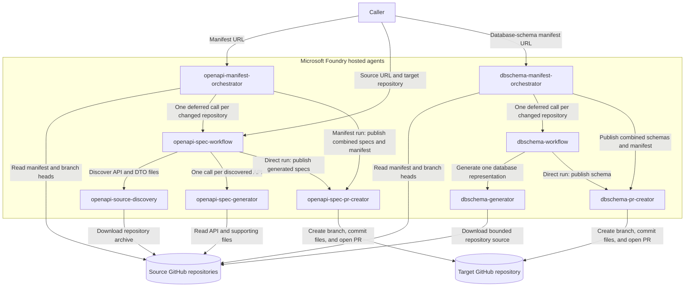

# Source Control Agent Pipelines

This repository contains Azure AI Foundry hosted agents for manifest-driven source analysis. Both the OpenAPI and database-schema pipelines generate repository artefacts and create one combined pull request for all successful manifest entries.

## Pipeline

1. [`openapi-source-discovery`](agents/hosted/openapi/openapi-source-discovery/README.md) scans one GitHub repository path and returns a root JSON array of `{apiFile, supportingFiles}` objects.
2. [`openapi-spec-generator`](agents/hosted/openapi/openapi-spec-generator/README.md) accepts one discovery element and returns an OpenAPI 3.1 JSON object.
3. [`openapi-spec-pr-creator`](agents/hosted/openapi/openapi-spec-pr-creator/README.md) accepts all generated specs, writes them to a destination repository, and opens a pull request.
4. [`openapi-spec-workflow`](agents/hosted/openapi/openapi-spec-workflow/README.md) runs the complete sequence, invoking the generator once per discovered API and sending the combined result to the PR creator.
5. [`openapi-manifest-orchestrator`](agents/hosted/openapi/openapi-manifest-orchestrator/README.md) checks manifest commit hashes and creates one combined specs-and-manifest pull request for changed repositories.

### Agent interactions and dependencies



The dependency order is:

- `openapi-source-discovery`, `openapi-spec-generator`, and `openapi-spec-pr-creator` are leaf agents and can be deployed independently.
- `openapi-spec-workflow` depends on all three leaf agents.
- `openapi-manifest-orchestrator` depends on `openapi-spec-workflow` and `openapi-spec-pr-creator`.
- `dbschema-generator` and `dbschema-pr-creator` are database-schema leaf agents.
- `dbschema-workflow` depends on both leaf agents.
- `dbschema-manifest-orchestrator` depends on `dbschema-workflow` and `dbschema-pr-creator`.

Previous workflows, scripts, prompt agents, and documentation are retained under [`backup/`](backup/).

## Database schema orchestration

[`dbschema-generator`](agents/hosted/dbschema/dbschema-generator/README.md) scans a repository path for database entities and returns tables, columns, relationships, indexes, and named types. [`dbschema-workflow`](agents/hosted/dbschema/dbschema-workflow/README.md) generates and optionally publishes one repository schema. [`dbschema-manifest-orchestrator`](agents/hosted/dbschema/dbschema-manifest-orchestrator/README.md) invokes one deferred workflow per changed repository and sends all successful schemas plus the updated manifest to [`dbschema-pr-creator`](agents/hosted/dbschema/dbschema-pr-creator/README.md) in one request.

## Run the complete workflow

Invoke `openapi-spec-workflow` with:

```json
{
  "sourceUrl": "https://github.com/owner/application/tree/main/src/Api",
  "targetRepository": "owner/api-specifications",
  "targetDirectory": "application/open-api",
  "targetBaseBranch": "main"
}
```

Only `sourceUrl` and `targetRepository` are required. The response is always JSON and contains discovery/generation counts, per-file generation errors, and the PR creator result including `pullRequestUrl`.

Generated file paths are deterministic and flat. By default, `src/Api/BidsController.cs` from the `application` repository becomes `application/open-api/BidsController.openapi.json`.

## Deploy

Deploy in dependency order:

```bash
cd agents/hosted/openapi/openapi-source-discovery
azd deploy openapi-source-discovery --no-prompt

cd ../openapi-spec-generator
azd deploy openapi-spec-generator --no-prompt

cd ../openapi-spec-pr-creator
azd deploy openapi-spec-pr-creator --no-prompt

cd ../openapi-spec-workflow
azd deploy openapi-spec-workflow --no-prompt

cd ../openapi-manifest-orchestrator
azd deploy openapi-manifest-orchestrator --no-prompt
```

Each project also has a deployment workflow under `.github/workflows/`. See [DEPLOYMENT.md](DEPLOYMENT.md) for Azure/GitHub configuration and permissions.

The database-schema agents can be deployed in their current dependency order:

```bash
cd agents/hosted/dbschema/dbschema-generator
azd deploy dbschema-generator --no-prompt

cd ../dbschema-pr-creator
azd deploy dbschema-pr-creator --no-prompt

cd ../dbschema-workflow
azd deploy dbschema-workflow --no-prompt

cd ../dbschema-manifest-orchestrator
azd deploy dbschema-manifest-orchestrator --no-prompt
```

The manifest orchestrator is initially manual and has no schedule. Invoke it with one manifest blob URL; a Foundry routine can be added later for recurring execution.

## Test

```bash
python3 -m unittest discover -s agents/hosted/openapi/openapi-source-discovery/src/openapi-source-discovery -p 'test_*.py'
python3 -m unittest discover -s agents/hosted/openapi/openapi-spec-generator/src/openapi-spec-generator -p 'test_*.py'
python3 -m unittest discover -s agents/hosted/openapi/openapi-spec-pr-creator/src/openapi-spec-pr-creator -p 'test_*.py'
python3 -m unittest discover -s agents/hosted/openapi/openapi-spec-workflow/src/openapi-spec-workflow -p 'test_*.py'
python3 -m unittest discover -s agents/hosted/openapi/openapi-manifest-orchestrator/src/openapi-manifest-orchestrator -p 'test_*.py'
python3 -m unittest discover -s agents/hosted/dbschema/dbschema-manifest-orchestrator/src/dbschema-manifest-orchestrator -p 'test_*.py'
python3 -m unittest discover -s agents/hosted/dbschema/dbschema-generator/src/dbschema-generator -p 'test_*.py'
python3 -m unittest discover -s agents/hosted/dbschema/dbschema-pr-creator/src/dbschema-pr-creator -p 'test_*.py'
python3 -m unittest discover -s agents/hosted/dbschema/dbschema-workflow/src/dbschema-workflow -p 'test_*.py'
```
